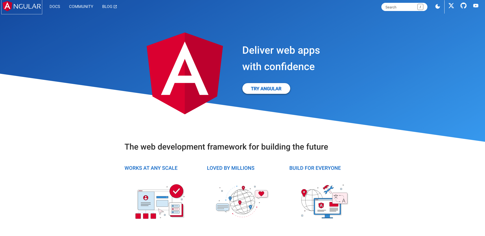

= How to Create Angular Project
:toc: left
:toclevels: 5
:sectnums:



---

### Prerequisites:

1. **Node.js and npm:**
- Download and install Node.js from the official website: [Node.js Downloads](https://nodejs.org/).
- npm (Node Package Manager) is included with Node.js.

2. **Angular CLI:**
- Once Node.js and npm are installed, open a terminal or command prompt and run the following command to install Angular CLI globally:
```bash
npm install -g @angular/cli
```

### Steps to Create an Angular Project:

1. **Create a new Angular project:**
- Open a terminal or command prompt.
- Run the following command to create a new Angular project (replace `project1` with your desired project name):
```bash
ng new project1
```
- Follow the prompts to customize your project (e.g., choose the stylesheet format, enable Angular routing).

2. **Navigate to the project directory:**
- Change into the newly created project directory using the `cd` command:
```bash
cd project1
```

3. **Serve the application:**
- Use the following command to build and serve the Angular application locally:
```bash
ng serve
```
- This will start a development server, and you can view your Angular application by opening a web browser and navigating to `http://localhost:4200/`.

4. **Optional: Open in Code Editor (e.g., Visual Studio Code):**
- If you have a preferred code editor, you can open the project in it. For example, to open the project in Visual Studio Code, run:
```bash
code .
```